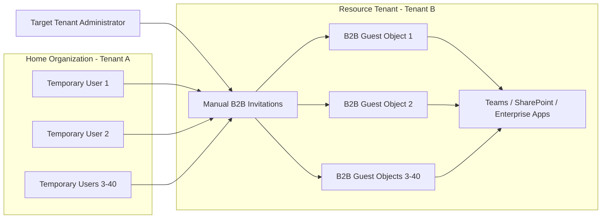
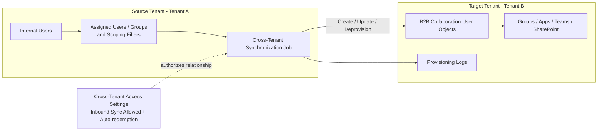
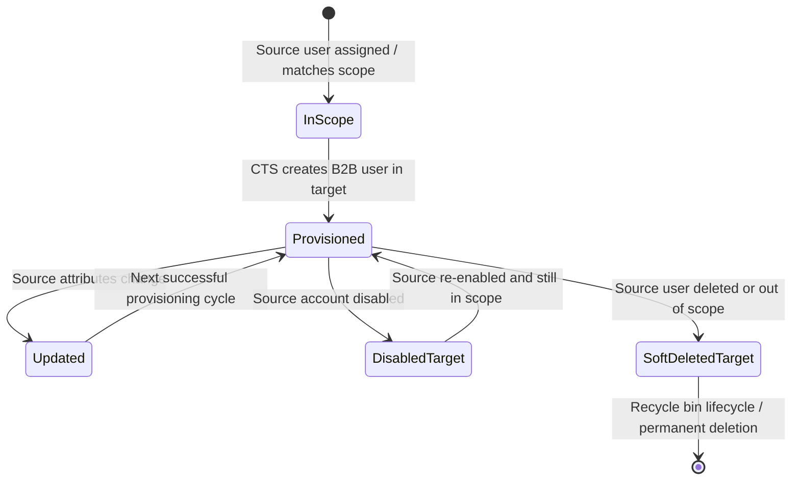
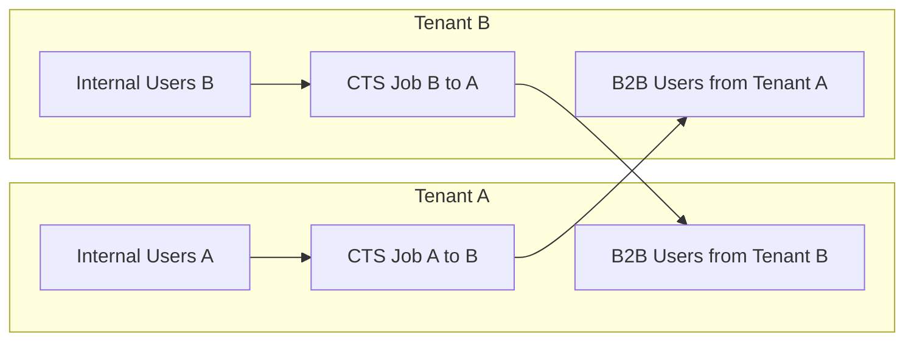
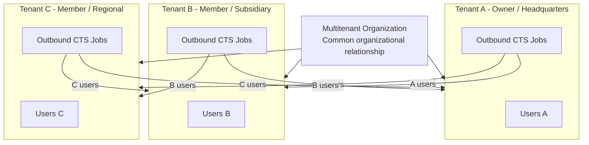
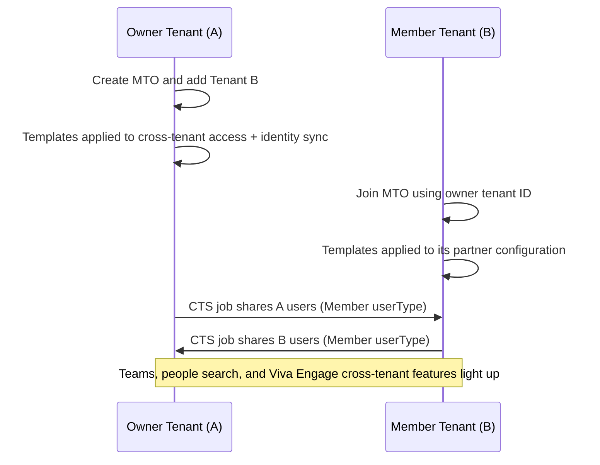
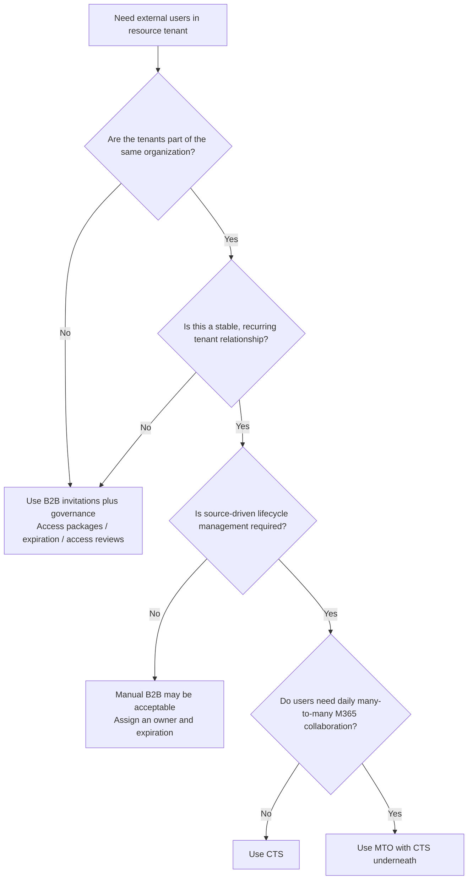
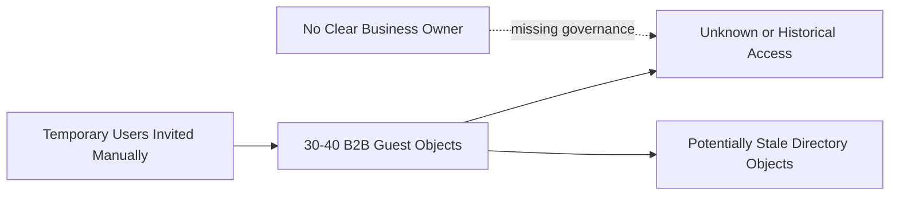

# Microsoft Entra Cross-Tenant Synchronization (CTS) vs. Multitenant Organizations (MTO)

A practical reference for identity and cloud security engineers on how **Cross-Tenant Synchronization (CTS)** and **Multitenant Organizations (MTO)** work, how they differ, when to use each, and how to govern them safely.

> **Short version:** CTS is the identity provisioning and lifecycle **engine**. MTO is the broader **organizational and Microsoft 365 collaboration framework**. MTO uses CTS underneath to share users, but CTS can also be used without MTO.

---

## Table of Contents

1. [Purpose](#1-purpose)
2. [Key Takeaways](#2-key-takeaways)
3. [Terminology](#3-terminology)
4. [CTS vs MTO: Key Differences](#4-cts-vs-mto-key-differences)
5. [Architecture and Topologies](#5-architecture-and-topologies)
   - [5.1 Manual B2B Invitation Topology](#51-manual-b2b-invitation-topology)
   - [5.2 One-Way CTS Provisioning Topology](#52-one-way-cts-provisioning-topology)
   - [5.3 CTS User Lifecycle](#53-cts-user-lifecycle)
   - [5.4 Bidirectional CTS Requires Two One-Way Jobs](#54-bidirectional-cts-requires-two-one-way-jobs)
   - [5.5 Multitenant Organization Topology](#55-multitenant-organization-topology)
   - [5.6 Conceptual Stack](#56-conceptual-stack)
6. [Key Features](#6-key-features)
7. [Issues Each Solves](#7-issues-each-solves)
8. [What CTS and MTO Do Not Solve](#8-what-cts-and-mto-do-not-solve)
9. [Use Cases](#9-use-cases)
10. [When Organizations Would Use vs Should Use Each](#10-when-organizations-would-use-vs-should-use-each)
11. [Decision Tree](#11-decision-tree)
12. [Scenario: 30-40 Temporary Users and Stale Guests](#12-scenario-30-40-temporary-users-and-stale-guests)
13. [Security Considerations](#13-security-considerations)
14. [Troubleshooting Boundaries](#14-troubleshooting-boundaries)
15. [References](#15-references)
16. [Document Status](#16-document-status)

---

## 1. Purpose

This guide explains:

- What **Cross-Tenant Synchronization (CTS)** is
- What a **Multitenant Organization (MTO)** is
- How CTS and MTO relate to and differ from each other
- How CTS differs from manually inviting B2B collaboration users
- What happens when a source user is disabled, deleted, or removed from scope
- Key features, use cases, and the issues each solves
- When organizations **would** use each and when they **should** use each
- The stale-guest problem and practical governance options
- Security considerations for treating cross-tenant relationships as trust boundaries

---

## 2. Key Takeaways

| # | Takeaway |
|---|---|
| 1 | **CTS = provisioning engine. MTO = organizational and M365 collaboration framework.** MTO depends on CTS to share users. |
| 2 | **CTS is one-way.** Bidirectional access requires two jobs. An MTO with N tenants is a mesh of CTS relationships. |
| 3 | **Disabled in source → blocked in target. Deleted or out of scope → soft-deleted in target**, as long as the target **Delete** action is enabled. |
| 4 | **CTS only governs the objects it created.** It does not clean up historically, manually invited guests. |
| 5 | **Manual B2B invitations create identities but provide no source-driven lifecycle.** Without ownership and reviews, they go stale. |
| 6 | **Use MTO when the tenants are one company and need a seamless Teams/M365 experience.** Use CTS alone when you only need lifecycle-managed access. |
| 7 | **Neither is designed for unrelated vendors, contractors, or partners.** Use B2B plus entitlement management, expiration, and access reviews. |
| 8 | **Stale guests are a governance problem, not a sync problem.** Do not deploy CTS just to make up for missing reviews and offboarding. |
| 9 | **Treat cross-tenant access settings as a trust boundary.** Scope them tightly, audit changes, and monitor the provisioning logs. |

---

## 3. Terminology

| Term | Definition |
|---|---|
| **B2B collaboration user** | An external identity represented by a user object in a resource tenant. The person authenticates against their home identity, and the resource tenant controls access to its own apps and data. |
| **Source tenant** | The tenant holding the authoritative internal user account that is selected for synchronization. |
| **Target tenant** | The tenant that receives the B2B collaboration user object created and maintained by CTS. |
| **Cross-Tenant Synchronization (CTS)** | A **one-way Microsoft Entra provisioning service** that automates creating, updating, and deprovisioning B2B collaboration users from a source tenant into a target tenant. |
| **Multitenant Organization (MTO)** | A declared relationship among multiple Entra and Microsoft 365 tenants that belong to the same organization, designed to give a more cohesive collaboration experience across them. |
| **Cross-tenant access settings** | Per-partner inbound and outbound policies that control B2B collaboration, B2B direct connect, trust settings (MFA and device claims), auto-redemption, and whether inbound sync is allowed. |
| **Owner tenant** | The tenant that creates the MTO and manages its membership. |
| **Member tenant** | A tenant that has joined an MTO. |

---

## 4. CTS vs MTO: Key Differences

| Area | Cross-Tenant Synchronization (CTS) | Multitenant Organization (MTO) |
|---|---|---|
| **Primary purpose** | Automate B2B identity provisioning and lifecycle | Represent multiple tenants as one organization and improve collaboration |
| **Functional layer** | Provisioning engine | Organizational and collaboration framework |
| **Direction** | One-way per configuration (A → B) | Many-to-many across all member tenants |
| **Who configures it** | Source tenant runs the job. Target tenant must allow inbound sync | Owner tenant creates the MTO. Member tenants join |
| **Object created** | B2B collaboration user in the target (userType Member by default, configurable) | Relies on CTS-created B2B users for cross-tenant experiences |
| **Can exist independently?** | Yes | No. User sharing depends on CTS |
| **Scale model** | Configured per tenant pair | Templates applied consistently as tenants join |
| **Best fit** | Stable tenant relationships that need automated identity lifecycle | A company with several owned tenants: subsidiaries, regions, acquisitions, business units |
| **Primary admin surfaces** | Entra: cross-tenant access settings, provisioning configuration, provisioning logs | M365 admin center, or Entra and Microsoft Graph for MTO membership and templates |
| **Licensing (validate)** | Entra ID P1 for synchronized users in the source tenant | P1 for the underlying CTS, plus M365 licensing for Teams and Viva Engage MTO features |
| **Troubleshooting starts at** | Scope, mappings, inbound policy, job status, provisioning logs | First decide whether the issue is MTO membership/experience or the CTS job underneath |

---

## 5. Architecture and Topologies

### 5.1 Manual B2B Invitation Topology



**How it works**

1. An administrator, app owner, group owner, or governed access process invites each external user.
2. A B2B collaboration user object is created in the resource tenant.
3. The resource tenant assigns the guest to groups, apps, Teams, sites, or other resources.
4. When the guest is no longer needed, the resource tenant must remove access and, when appropriate, delete the guest object.

**The problem:** manual invitations create user objects but **do not establish automated lifecycle management from the user's home tenant**. If nobody owns guest reviews and offboarding, old B2B objects stay in the directory after the business need ends.

---

### 5.2 One-Way CTS Provisioning Topology



**Configuration flow**

| Step | Tenant | Action |
|---|---|---|
| 1 | Target | Add the source tenant as an organization in cross-tenant access settings |
| 2 | Target | Enable **Allow users sync into this tenant** (inbound) |
| 3 | Target | Enable **automatic redemption** (inbound trust setting) |
| 4 | Source | Add the target tenant and enable **automatic redemption** (outbound) |
| 5 | Source | Create the CTS configuration (enterprise app) and test connectivity |
| 6 | Source | Assign users and groups, set scoping filters, and review attribute mappings (including userType) |
| 7 | Source | Use **Provision on demand** to test one user, then start the job |
| 8 | Both | Validate the results in the provisioning logs and in the target directory |

**Is CTS a replacement for manually inviting 1,000 users?** For the supported scenario of tenants within the same organization, **yes**. It removes the repeated invite-and-redeem process and adds ongoing lifecycle management. But CTS is not a bulk-invite utility. It creates an **ongoing provisioning relationship**, so the deciding questions are:

- Are both tenants part of the same organization or legal entity?
- Is there a stable tenant-to-tenant relationship?
- Is the source tenant willing to own the synchronization scope?
- Does the target tenant want source-driven lifecycle management?

---

### 5.3 CTS User Lifecycle



| Source event | Target B2B object result | Note |
|---|---|---|
| User added to scope | Created and auto-redeemed | Requires auto-redemption on both sides |
| Attribute changes | Updated on the next cycle (about every 40 minutes) | Only mapped attributes |
| Source account **disabled** | Target account blocked from sign-in | Disabled, **not** deleted |
| Source user **deleted** | Target object soft-deleted | Enters the target recycle bin |
| User **removed from scope** | Soft-deleted by default | Does not happen if the target **Delete** action is disabled |
| Target object deleted manually | Not guaranteed to be reprovisioned | Validate behavior in the provisioning logs |

**Guardrails**

1. Lifecycle behavior applies **only to objects managed by the CTS job**. CTS is not a cleanup engine for every guest already in the directory.
2. **The Delete target-object action matters.** If it is disabled, out-of-scope users are not soft-deleted.
3. **Soft deletion is not permanent erasure.** Objects enter the deleted-items lifecycle and can be restored.
4. **Manual target-side deletion is a separate event.** Validate recovery behavior instead of assuming CTS will resurrect the object.
5. **Provisioning logs are the proof point.** Confirm the action taken for each user rather than relying only on the current directory state.

---

### 5.4 Bidirectional CTS Requires Two One-Way Jobs



A job from Tenant A to Tenant B does **not** synchronize Tenant B users back to Tenant A. If both directions are needed, configure and govern two separate one-way relationships.

---

### 5.5 Multitenant Organization Topology



**MTO setup flow**



---

### 5.6 Conceptual Stack

```text
Multitenant Organization
        |
        +-- Organizational tenant relationship (owner + members)
        +-- Microsoft 365 collaboration experience
        +-- Cross-tenant access settings and templates
        |
        +-- Cross-Tenant Synchronization jobs
                |
                +-- Create B2B collaboration users
                +-- Update synchronized attributes
                +-- Deprovision synchronized users
```

---

## 6. Key Features

### Cross-Tenant Synchronization

| Feature | Description |
|---|---|
| **Scoping** | Assigned users and groups, plus attribute-based scoping filters |
| **Attribute mappings** | Sync profile attributes. Set **userType** to Member or Guest. Control `showInAddressList` |
| **Automatic redemption** | Removes the B2B consent prompt when allowed in both tenants |
| **Lifecycle actions** | Create, update, disable, and delete (soft-delete) target objects |
| **Provision on demand** | Test provisioning for a single user before turning on the job |
| **Provisioning logs** | Per-user record of every action, success, skip, and failure |
| **Target-side control** | The target must explicitly allow inbound sync per partner tenant |
| **Quarantine / health status** | The job enters quarantine after repeated failures, which flags misconfiguration |

### Multitenant Organization

| Feature | Description |
|---|---|
| **Owner and member model** | The owner tenant creates the MTO and manages membership. Members join using the owner's tenant ID |
| **Templates** | Cross-tenant access and identity sync templates are applied automatically as tenants join |
| **M365 admin center setup** | Guided user-sharing setup that creates the underlying CTS configurations |
| **Teams collaboration** | Improved cross-tenant chat, calls, and meetings with less tenant switching |
| **People search and profile cards** | Users in other member tenants are discoverable as colleagues |
| **Viva Engage** | Communities and announcements can span tenants |
| **Unified organization identity** | The tenants are formally recognized as one organization by Microsoft 365 services |

---

## 7. Issues Each Solves

| Problem | Manual B2B | CTS | MTO |
|---|---|---|---|
| Repetitive invite-and-redeem for many users | ❌ | ✅ | ✅ (via CTS) |
| Attribute drift: stale profile data on guest objects | ❌ | ✅ | ✅ (via CTS) |
| Leavers keep access in the other tenant | ❌ | ✅ (CTS-managed users only) | ✅ (via CTS) |
| Large-scale, per-user administration | ❌ | ✅ (groups, filters, mappings) | ✅ |
| Employees experienced as "guests" in Teams and search | ❌ | ⚠️ Partly (Member userType) | ✅ |
| No formal recognition that tenants are one organization | ❌ | ❌ | ✅ |
| Inconsistent policy as new tenants are added | ❌ | ❌ (configured per pair) | ✅ (templates) |
| Stale vendor, partner, or contractor guests | ❌ | ❌ | ❌ (use governance) |

### Issue detail

| Issue | How CTS addresses it |
|---|---|
| **Repetitive invitations** | Automatically creates scoped B2B users and auto-redeems invitations |
| **Attribute drift** | Keeps mapped attributes in sync with the source tenant |
| **Leaver lifecycle gaps** | Disables or deprovisions target objects based on source state, scope, and target-object-action settings |
| **Large-scale administration** | Replaces per-user handling with assignments, group scope, filters, mappings, and logs |
| **Multitenant employee collaboration** | Represents employees from one owned tenant in another and grants them access to apps and resources there |

| Issue | How MTO addresses it |
|---|---|
| **Fragmented collaboration** | Unifies the Teams, people search, and Viva Engage experience across tenants |
| **Policy sprawl across many tenant pairs** | Templates apply consistent cross-tenant access and sync settings |
| **"Second-class" colleague experience** | Users show up as organization members rather than as external guests |

---

## 8. What CTS and MTO Do Not Solve

- They do not decide whether a user should get a particular SharePoint site, Teams team, app role, or privileged role.
- They do not prove that a historically invited guest is still in use.
- They do not turn pre-existing, manually invited guests into governed CTS-managed objects.
- They do not replace access reviews, entitlement decisions, app assignment, Conditional Access, or cross-tenant access policy design.
- They are not the right design for unrelated vendors, contractors, or partners just because stale guests exist.

---

## 9. Use Cases

### Cross-Tenant Synchronization

| Use case | Example |
|---|---|
| **Mergers and acquisitions** | Give acquired-company employees lifecycle-managed access to parent-company apps before a tenant migration |
| **Divestitures (transitional)** | Keep a divested unit's users working in parent apps during a transition service agreement, then remove them from scope |
| **Subsidiary to HQ app access** | Subsidiary users need HQ's ERP, HR, or ticketing app. One-way access is enough |
| **Separate admin, research, or dev tenants** | Corporate users get provisioned into an isolated tenant with source-driven joiner/mover/leaver |
| **Affiliated entities in one organization** | A health system and an affiliated university in separate tenants, where researchers need specific apps in the health tenant |

### Multitenant Organization

| Use case | Example |
|---|---|
| **Conglomerates with many owned tenants** | HQ plus several subsidiaries whose employees collaborate daily in Teams |
| **Regional or sovereign-data tenant split** | Regional tenants (for example, EU and US) for data residency that still operate as one company |
| **Post-merger "one company" experience** | Two merged companies keep separate tenants long-term but want unified people search and Teams |
| **Consistent onboarding of new tenants** | Templates make sure every newly acquired tenant joins with the same cross-tenant policy |

---

## 10. When Organizations Would Use vs Should Use Each

**"Would use"** describes the triggers that usually lead an organization to consider the option. **"Should use"** describes the conditions that make it the right design choice.

| Option | Organizations **would** use it when... | Organizations **should** use it only when... |
|---|---|---|
| **Manual B2B** | A small number of users need ad-hoc access, often from external organizations | Every guest has a sponsor, an expiration, and a periodic review. Ideally use access packages |
| **CTS alone** | Hundreds or thousands of users from another tenant need access, and manual invites don't scale | The tenants belong to the same organization, the relationship is stable, the source owns scope, and the target accepts source-driven lifecycle. Collaboration needs are mostly app access |
| **MTO (with CTS)** | Employees across several owned tenants complain about guest experiences, tenant switching, or not being able to find colleagues | The tenants are one company, collaboration is daily and many-to-many, M365 licensing supports the features, and there is central ownership of cross-tenant policy |
| **B2B + entitlement management / access reviews** | Stale guests have piled up, or vendors and contractors need time-bound access | The users are external or temporary, or the relationship is not between tenants of the same organization |

### Anti-patterns

| Anti-pattern | Why it's wrong | Better choice |
|---|---|---|
| Deploying CTS to clean up stale guests | CTS doesn't govern pre-existing guests | Access reviews plus a cleanup project |
| Using CTS for unrelated vendors | It trusts another organization's directory to create users in yours | B2B plus access packages |
| Using MTO when only one-way app access is needed | Adds complexity and licensing with no benefit | CTS alone |
| Turning off the target **Delete** action "to be safe" | Leavers stay in the target indefinitely | Keep Delete on. Use soft-delete recovery if needed |

---

## 11. Decision Tree



---

## 12. Scenario: 30-40 Temporary Users and Stale Guests

### Current state



**The root problem is not a lack of CTS. It is the lack of an owned guest-lifecycle process.**

### Would CTS solve it?

- **Yes, possibly,** if these users come from another tenant **in the same organization** and the customer wants a durable, source-driven provisioning relationship.
- **Probably not the first choice** if they are vendors, partners, or contractors from unrelated organizations. User count is not the deciding factor. Relationship type and lifecycle ownership are.

### Immediate cleanup

1. Inventory the B2B users and identify each sponsoring owner.
2. Review group membership, app assignments, Teams membership, SharePoint permissions, directory-role assignments, and recent sign-in activity.
3. Require the business owner to confirm continued need.
4. Remove resource assignments before or together with guest cleanup, following change control.
5. Disable or delete unneeded guests according to retention and security policy.
6. Document the decision and owner for every retained account.

### Ongoing governance

| Control | Purpose |
|---|---|
| **Entitlement management access packages** | Request, approval, expiration, and renewal-based access |
| **Access reviews** | Periodic recertification of guest access |
| **Time-bound assignments** | Access that expires automatically |
| **Sponsor/owner field plus expiration date** | Accountability for every temporary external identity |
| **Recurring review of orphaned guests** | Catch guests with no owner, no assignments, or no sign-in activity |

### Recommendation

> Keep standard B2B collaboration for the small temporary population and add a real governance process using access packages and/or access reviews. Do not deploy CTS only as a workaround for poor guest cleanup. Consider CTS if the users come from a stable tenant in the same organization and the customer wants that tenant to drive provisioning and offboarding.

---

## 13. Security Considerations

| Risk | Why it matters | Control |
|---|---|---|
| **Source tenant admin compromise** | An attacker in the source could put accounts in scope and have them pushed into the target | Allow inbound sync only for specific partner tenants. Alert on CTS configuration changes and on spikes in provisioning "create" events |
| **Member userType has broader default permissions** | Synced Members can read more of the directory than Guests | Choose userType deliberately. Restrict default user permissions where appropriate |
| **Inbound trust of MFA and device claims** | The target accepts the source's MFA and device compliance | Enable trust only where the source tenant's Conditional Access posture is known and enforced |
| **Conditional Access gaps** | CTS users can fall outside policies scoped to "internal users" | Target CA policies at guest and external user types, including B2B collaboration members |
| **Overlapping CTS jobs** | Conflicting results for the same users | One job per source → target user population |
| **Delete action disabled** | Leavers stay in the target indefinitely | Keep Delete enabled. Document any exceptions |
| **Soft-delete assumptions** | Soft-deleted objects can be restored | Monitor the recycle bin. Hard-delete when policy requires |
| **Configuration drift in MTO** | Template changes affect every tenant that joins later | Change-control MTO templates. Review partner configurations periodically |

### Monitoring checklist

- [ ] Alert on changes to cross-tenant access settings (inbound sync, auto-redemption, trust settings)
- [ ] Alert on CTS job configuration, scope, and mapping changes
- [ ] Monitor provisioning logs for unusual create volumes or failures
- [ ] Watch for CTS jobs going into quarantine
- [ ] Review MTO membership changes (tenants added or removed)
- [ ] Recertify synced populations through access reviews where risk warrants

---

## 14. Troubleshooting Boundaries

### "MTO users are not appearing"

Start with the underlying CTS provisioning path:

1. Confirm the partner tenant and cross-tenant access settings.
2. Confirm the target tenant allows inbound synchronization.
3. Confirm auto-redemption settings on both sides.
4. Confirm the source user is internal and in scope.
5. Review assignment and scoping filters.
6. Review attribute mappings.
7. Review the source provisioning job status and provisioning logs.
8. Check for overlapping CTS jobs targeting the same tenant and users.

### "Stale manually invited guests"

This is a **B2B identity governance and lifecycle ownership problem**, not a CTS failure. First determine whether the users are manually invited or CTS-managed, then choose the remediation path.

### "Source user disabled or deleted, but target user still active"

1. Was the target object actually created and managed by the CTS job?
2. Is the source user still in scope?
3. Is the provisioning job running and healthy (not in quarantine)?
4. What action appears in the user's provisioning logs?
5. Is the target-object **Delete** action enabled?
6. Is another CTS configuration overlapping the same target and scope?
7. Was the target object changed or deleted manually outside the job?

---

## 15. References

- [What is cross-tenant synchronization in Microsoft Entra ID?](https://learn.microsoft.com/en-us/entra/identity/multi-tenant-organizations/cross-tenant-synchronization-overview)
- [Configure cross-tenant synchronization](https://learn.microsoft.com/en-us/entra/identity/multi-tenant-organizations/cross-tenant-synchronization-configure)
- [Governance and cross-tenant synchronization](https://learn.microsoft.com/en-us/entra/identity/multi-tenant-organizations/cross-tenant-synchronization-governance)
- [Multitenant organization capabilities in Microsoft Entra ID](https://learn.microsoft.com/en-us/entra/identity/multi-tenant-organizations/overview)
- [What is a multitenant organization in Microsoft Entra ID?](https://learn.microsoft.com/en-us/entra/identity/multi-tenant-organizations/multi-tenant-organization-overview)
- [Limitations and known issues for multitenant organizations](https://learn.microsoft.com/en-us/entra/identity/multi-tenant-organizations/multi-tenant-organization-known-issues)
- [Cross-tenant access settings for B2B collaboration](https://learn.microsoft.com/en-us/entra/external-id/cross-tenant-access-settings-b2b-collaboration)
- [Microsoft Entra access reviews](https://learn.microsoft.com/en-us/entra/id-governance/access-reviews-overview)
- [Microsoft Entra entitlement management](https://learn.microsoft.com/en-us/entra/id-governance/entitlement-management-overview)

---

## 16. Document Status

This README is a technical explanation and support reference. Licensing requirements, MTO tenant limits, and feature availability change over time. Validate production design choices against current Microsoft documentation, licensing, tenant topology, cross-tenant access policies, and your organization's governance requirements.
